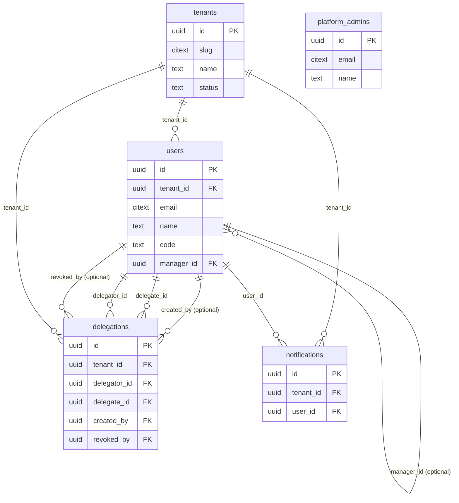
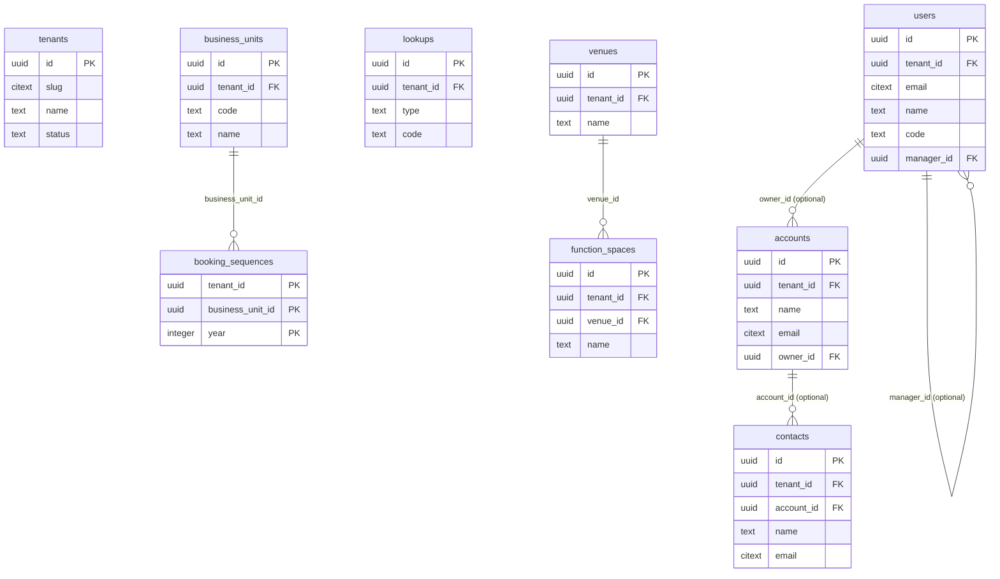

# Database reference

> Generated by `npm run docs:db -w apps/api` from the live PostgreSQL catalog. Descriptions come from `COMMENT ON` statements in the migrations, so this file always matches the real schema. **Do not edit by hand**: change the migration and regenerate.

PostgreSQL schema `public` · 21 tables · 2 views · 15 functions · 51 row-level-security policies · migrations: `001_init.sql`, `002_workspace_approval.sql`, `003_team_hierarchy.sql`, `004_delegation.sql`, `005_i18n_appearance_docs.sql`

## Contents

1. [How the database is organised](#how-the-database-is-organised)
2. [Entity-relationship diagrams](#entity-relationship-diagrams)
3. [Tables](#tables)
4. [Views](#views)
5. [Functions](#functions)
6. [Row-level security policies](#row-level-security-policies)
7. [Database roles](#database-roles)

## How the database is organised

- **Multi-tenant, shared schema.** Every business table has `tenant_id`. Row-level security (RLS) only shows rows of the tenant set for the transaction (`app.tenant_id`, read by `current_tenant_id()`).
- **Team visibility and cover** are extra *restrictive* RLS policies on bookings and everything inside them. They use the signed-in user and their team, set per request (`app.see_all`, `app.user_id`, `app.team_ids` for reading, `app.write_ids` for changing).
- **Money** is `numeric(14,3)` (KWD has three decimals). Derived figures (margin, net profit, outstanding...) are never stored; the `booking_finance` view computes them.
- **Audit**: status changes go to `booking_status_history`, and every other booking change to `booking_log`, both with *on behalf of* when someone was covering.
- **SECURITY DEFINER functions** are the only way to read across tenants or teams: login lookup, the operator console, room-clash checks and the diary.

## Entity-relationship diagrams

Primary keys are marked `PK`, foreign keys `FK`. Only key columns are drawn; full column lists are in [Tables](#tables).

### Workspace, people and access



### Configuration and clients



### Sales: bookings and everything inside them

```mermaid
erDiagram
  bookings {
    uuid id PK
    uuid tenant_id FK
    text booking_no
    uuid business_unit_id FK
    text name
    text status
    uuid owner_id FK
    uuid account_id FK
    uuid contact_id FK
    uuid venue_id FK
    uuid function_space_id FK
    uuid created_by FK
  }
  booking_events {
    uuid id PK
    uuid tenant_id FK
    uuid booking_id FK
    uuid function_space_id FK
    text name
  }
  booking_items {
    uuid id PK
    uuid tenant_id FK
    uuid booking_id FK
    uuid event_id FK
  }
  payments {
    uuid id PK
    uuid tenant_id FK
    uuid booking_id FK
    uuid created_by FK
  }
  booking_payouts {
    uuid id PK
    uuid tenant_id FK
    uuid booking_id FK
    uuid user_id FK
    text status
  }
  activities {
    uuid id PK
    uuid tenant_id FK
    uuid booking_id FK
    uuid account_id FK
    uuid contact_id FK
    uuid owner_id FK
    text type
    uuid completed_by FK
    uuid completed_on_behalf_of FK
  }
  booking_status_history {
    uuid id PK
    uuid tenant_id FK
    uuid booking_id FK
    uuid changed_by FK
    uuid on_behalf_of FK
  }
  booking_log {
    uuid id PK
    uuid tenant_id FK
    uuid booking_id FK
    uuid actor_id FK
    uuid on_behalf_of FK
  }
  contacts {
    uuid id PK
    uuid tenant_id FK
    uuid account_id FK
    text name
    citext email
  }
  accounts {
    uuid id PK
    uuid tenant_id FK
    text name
    citext email
    uuid owner_id FK
  }
  venues {
    uuid id PK
    uuid tenant_id FK
    text name
  }
  function_spaces {
    uuid id PK
    uuid tenant_id FK
    uuid venue_id FK
    text name
  }
  business_units {
    uuid id PK
    uuid tenant_id FK
    text code
    text name
  }
  users {
    uuid id PK
    uuid tenant_id FK
    citext email
    text name
    text code
    uuid manager_id FK
  }
  users ||--o{ accounts : "owner_id (optional)"
  accounts ||--o{ activities : "account_id (optional)"
  bookings ||--o{ activities : "booking_id (optional)"
  contacts ||--o{ activities : "contact_id (optional)"
  users ||--o{ activities : "owner_id (optional)"
  bookings ||--o{ booking_events : "booking_id"
  function_spaces ||--o{ booking_events : "function_space_id (optional)"
  bookings ||--o{ booking_items : "booking_id"
  booking_events ||--o{ booking_items : "event_id (optional)"
  bookings ||--o{ booking_log : "booking_id"
  bookings ||--o{ booking_payouts : "booking_id"
  bookings ||--o{ booking_status_history : "booking_id"
  accounts ||--o{ bookings : "account_id (optional)"
  business_units ||--o{ bookings : "business_unit_id"
  contacts ||--o{ bookings : "contact_id (optional)"
  function_spaces ||--o{ bookings : "function_space_id (optional)"
  users ||--o{ bookings : "owner_id (optional)"
  venues ||--o{ bookings : "venue_id (optional)"
  accounts ||--o{ contacts : "account_id (optional)"
  venues ||--o{ function_spaces : "venue_id"
  bookings ||--o{ payments : "booking_id"
```



## Tables

| Table | Purpose | RLS |
|---|---|---|
| [`accounts`](#table-accounts) | Client companies (corporate, agency, government). | yes |
| [`activities`](#table-activities) | Meetings, calls, follow-ups, site visits and tasks; usually linked to a booking. | yes |
| [`booking_events`](#table-booking_events) | Functions inside a booking placed on the function diary: room, start and end, setup and guest numbers. | yes |
| [`booking_items`](#table-booking_items) | Priced revenue / cost lines of a booking (F&B, decor, AV, manpower...). When present they drive revenue and cost. | yes |
| [`booking_log`](#table-booking_log) | Audit trail of changes to a booking (fields, events, lines, payments, follow-ups, transfers) with actor and on-behalf-of. | yes |
| [`booking_payouts`](#table-booking_payouts) | Commission (to the account manager) and partner shares of a booking, as a percentage; amounts are computed by booking_payout_amounts. | yes |
| [`booking_sequences`](#table-booking_sequences) | Last booking number used per business unit and year; incremented atomically when a booking is created. | yes |
| [`booking_status_history`](#table-booking_status_history) | Every status change of a booking, with reason, who made it and on whose behalf. | yes |
| [`bookings`](#table-bookings) | The sales record (one row of the CONTRACTS sheet): enquiry to actualised event, with status, client, venue, dates, owner and manual financial figures. | yes |
| [`business_units`](#table-business_units) | Brands or companies inside a workspace (the CO column of the daily report). The code prefixes booking numbers, e.g. W2026001. | yes |
| [`contacts`](#table-contacts) | Client people. A booking points at a contact; contacts are shared across the whole workspace. | yes |
| [`delegations`](#table-delegations) | Cover arrangements: a delegate may see (and optionally act on) a delegator's records between two dates. | yes |
| [`function_spaces`](#table-function_spaces) | Bookable rooms inside a venue. Exclusive rooms are protected against double-booking; shareable ones (allow_overlap) are not. | yes |
| [`lookups`](#table-lookups) | Configurable pick-lists (the PAR sheet): event types, lead sources, lost reasons, payment methods, bank accounts, setup styles, line categories, business types. | yes |
| [`notifications`](#table-notifications) | In-app notifications shown under the bell (cover set-up, transfers...). | yes |
| [`payments`](#table-payments) | Money received from the client against a booking. | yes |
| [`platform_admins`](#table-platform_admins) | Operators of the SaaS platform who approve and manage workspaces. Not tenant data. | — |
| [`schema_migrations`](#table-schema_migrations) | Migrations already applied by scripts/migrate.ts. | — |
| [`tenants`](#table-tenants) | A customer company (workspace). Every business row belongs to exactly one tenant; row-level security keeps tenants apart. | yes |
| [`users`](#table-users) | People in a workspace: login users and account managers without a login. Holds role, reporting line (manager_id) and data scope. | yes |
| [`venues`](#table-venues) | Properties and locations where events take place (hotels, halls, client homes). | yes |

### Table: accounts

Client companies (corporate, agency, government).

| Column | Type | Null | Default | Description |
|---|---|---|---|---|
| `id` 🔑 | uuid |  | `gen_random_uuid()` | Primary key. |
| `tenant_id` 🔗 | uuid |  |  | Workspace the row belongs to; row-level security filters on it. |
| `name` | text |  |  |  |
| `kind` | text |  | `'company'::text` | company, agency, government or individual. |
| `business_type` | text | yes |  | Lookup code from business_type. |
| `phone` | text | yes |  |  |
| `email` | citext | yes |  |  |
| `address` | text | yes |  |  |
| `country` | text | yes |  |  |
| `notes` | text | yes |  |  |
| `owner_id` 🔗 | uuid | yes |  | Account manager responsible for the company. |
| `created_at` | timestamp with time zone |  | `now()` | When the row was created. |
| `updated_at` | timestamp with time zone |  | `now()` | When the row last changed (trigger). |

**References:** `owner_id` → [`users`](#table-users) (on delete set null) · `tenant_id` → [`tenants`](#table-tenants) (on delete cascade)

**Referenced by:** `activities`, `bookings`, `contacts`

**Rules (checks):**
- `CHECK ((kind = ANY (ARRAY['company'::text, 'agency'::text, 'government'::text, 'individual'::text])))`

**RLS policies:** `tenant_isolation` (all, permissive)

**Triggers:** `accounts_touch`

### Table: activities

Meetings, calls, follow-ups, site visits and tasks; usually linked to a booking.

| Column | Type | Null | Default | Description |
|---|---|---|---|---|
| `id` 🔑 | uuid |  | `gen_random_uuid()` | Primary key. |
| `tenant_id` 🔗 | uuid |  |  | Workspace the row belongs to; row-level security filters on it. |
| `booking_id` 🔗 | uuid | yes |  | References `bookings`. |
| `account_id` 🔗 | uuid | yes |  | References `accounts`. |
| `contact_id` 🔗 | uuid | yes |  | References `contacts`. |
| `owner_id` 🔗 | uuid | yes |  | References `users`. |
| `type` | text |  |  | meeting, call, followup, site_visit, email or task. |
| `subject` | text |  |  |  |
| `due_at` | timestamp with time zone |  |  | When it is due. |
| `location` | text | yes |  |  |
| `notes` | text | yes |  |  |
| `outcome` | text | yes |  | Result / client feedback recorded on completion. |
| `completed_at` | timestamp with time zone | yes |  |  |
| `created_at` | timestamp with time zone |  | `now()` | When the row was created. |
| `completed_by` 🔗 | uuid | yes |  | Who completed it. |
| `completed_on_behalf_of` 🔗 | uuid | yes |  | Whose follow-up it was, when completed by someone covering. |

**References:** `account_id` → [`accounts`](#table-accounts) (on delete cascade) · `booking_id` → [`bookings`](#table-bookings) (on delete cascade) · `completed_by` → [`users`](#table-users) (on delete set null) · `completed_on_behalf_of` → [`users`](#table-users) (on delete set null) · `contact_id` → [`contacts`](#table-contacts) (on delete set null) · `owner_id` → [`users`](#table-users) (on delete set null) · `tenant_id` → [`tenants`](#table-tenants) (on delete cascade)

**Rules (checks):**
- `CHECK ((type = ANY (ARRAY['meeting'::text, 'call'::text, 'followup'::text, 'site_visit'::text, 'email'::text, 'task'::text])))`

**Indexes:** `activities_due_idx`

**RLS policies:** `team_delete` (delete, restrictive), `team_insert` (insert, restrictive), `team_read` (select, restrictive), `team_update` (update, restrictive), `tenant_isolation` (all, permissive)

### Table: booking_events

Functions inside a booking placed on the function diary: room, start and end, setup and guest numbers.

| Column | Type | Null | Default | Description |
|---|---|---|---|---|
| `id` 🔑 | uuid |  | `gen_random_uuid()` | Primary key. |
| `tenant_id` 🔗 | uuid |  |  | Workspace the row belongs to; row-level security filters on it. |
| `booking_id` 🔗 | uuid |  |  | References `bookings`. |
| `function_space_id` 🔗 | uuid | yes |  | References `function_spaces`. |
| `name` | text |  |  |  |
| `setup_style` | text | yes |  | Lookup code from setup_style. |
| `start_at` | timestamp with time zone |  |  |  |
| `end_at` | timestamp with time zone |  |  |  |
| `expected_pax` | integer | yes |  | Expected guests. |
| `guaranteed_pax` | integer | yes |  | Guaranteed (billable) guests. |
| `notes` | text | yes |  |  |
| `created_at` | timestamp with time zone |  | `now()` | When the row was created. |

**References:** `booking_id` → [`bookings`](#table-bookings) (on delete cascade) · `function_space_id` → [`function_spaces`](#table-function_spaces) (on delete set null) · `tenant_id` → [`tenants`](#table-tenants) (on delete cascade)

**Referenced by:** `booking_items`

**Rules (checks):**
- `CHECK ((end_at > start_at))`

**Indexes:** `booking_events_space_idx`

**RLS policies:** `team_delete` (delete, restrictive), `team_insert` (insert, restrictive), `team_read` (select, restrictive), `team_update` (update, restrictive), `tenant_isolation` (all, permissive)

### Table: booking_items

Priced revenue / cost lines of a booking (F&B, decor, AV, manpower...). When present they drive revenue and cost.

| Column | Type | Null | Default | Description |
|---|---|---|---|---|
| `id` 🔑 | uuid |  | `gen_random_uuid()` | Primary key. |
| `tenant_id` 🔗 | uuid |  |  | Workspace the row belongs to; row-level security filters on it. |
| `booking_id` 🔗 | uuid |  |  | References `bookings`. |
| `event_id` 🔗 | uuid | yes |  | References `booking_events`. |
| `category` | text |  | `'F&B'::text` | Lookup code from item_category. |
| `description` | text |  |  |  |
| `quantity` | numeric(12,3) |  | `1` |  |
| `unit_price` | numeric(14,3) |  | `0` | Selling price per unit. |
| `unit_cost` | numeric(14,3) |  | `0` | Cost per unit. |
| `sort_order` | integer |  | `0` |  |
| `created_at` | timestamp with time zone |  | `now()` | When the row was created. |

**References:** `booking_id` → [`bookings`](#table-bookings) (on delete cascade) · `event_id` → [`booking_events`](#table-booking_events) (on delete set null) · `tenant_id` → [`tenants`](#table-tenants) (on delete cascade)

**Indexes:** `booking_items_booking_idx`

**RLS policies:** `team_delete` (delete, restrictive), `team_insert` (insert, restrictive), `team_read` (select, restrictive), `team_update` (update, restrictive), `tenant_isolation` (all, permissive)

### Table: booking_log

Audit trail of changes to a booking (fields, events, lines, payments, follow-ups, transfers) with actor and on-behalf-of.

| Column | Type | Null | Default | Description |
|---|---|---|---|---|
| `id` 🔑 | uuid |  | `gen_random_uuid()` | Primary key. |
| `tenant_id` 🔗 | uuid |  |  | Workspace the row belongs to; row-level security filters on it. |
| `booking_id` 🔗 | uuid |  |  | References `bookings`. |
| `actor_id` 🔗 | uuid | yes |  | References `users`. |
| `on_behalf_of` 🔗 | uuid | yes |  | Set when the actor was covering for the booking owner. |
| `action` | text |  |  | What happened, e.g. updated, event added, payment recorded, transferred. |
| `details` | jsonb |  | `'{}'::jsonb` | JSON details: changed fields, amounts, names. |
| `created_at` | timestamp with time zone |  | `now()` | When the row was created. |

**References:** `actor_id` → [`users`](#table-users) (on delete set null) · `booking_id` → [`bookings`](#table-bookings) (on delete cascade) · `on_behalf_of` → [`users`](#table-users) (on delete set null) · `tenant_id` → [`tenants`](#table-tenants) (on delete cascade)

**Indexes:** `booking_log_booking_idx`

**RLS policies:** `team_delete` (delete, restrictive), `team_insert` (insert, restrictive), `team_read` (select, restrictive), `team_update` (update, restrictive), `tenant_isolation` (all, permissive)

### Table: booking_payouts

Commission (to the account manager) and partner shares of a booking, as a percentage; amounts are computed by booking_payout_amounts.

| Column | Type | Null | Default | Description |
|---|---|---|---|---|
| `id` 🔑 | uuid |  | `gen_random_uuid()` | Primary key. |
| `tenant_id` 🔗 | uuid |  |  | Workspace the row belongs to; row-level security filters on it. |
| `booking_id` 🔗 | uuid |  |  | References `bookings`. |
| `kind` | text |  |  | commission (share of net profit) or share (share of what remains after commission). |
| `payee_name` | text |  |  |  |
| `user_id` 🔗 | uuid | yes |  | References `users`. |
| `pct` | numeric(6,4) |  |  | Percentage as a fraction (0.10 = 10%). |
| `status` | text |  | `'pending'::text` | pending or paid. |
| `paid_on` | date | yes |  |  |
| `created_at` | timestamp with time zone |  | `now()` | When the row was created. |

**References:** `booking_id` → [`bookings`](#table-bookings) (on delete cascade) · `tenant_id` → [`tenants`](#table-tenants) (on delete cascade) · `user_id` → [`users`](#table-users) (on delete set null)

**Rules (checks):**
- `CHECK ((kind = ANY (ARRAY['commission'::text, 'share'::text])))`
- `CHECK (((pct >= (0)::numeric) AND (pct <= (1)::numeric)))`
- `CHECK ((status = ANY (ARRAY['pending'::text, 'paid'::text])))`

**Indexes:** `booking_payouts_booking_idx`

**RLS policies:** `team_delete` (delete, restrictive), `team_insert` (insert, restrictive), `team_read` (select, restrictive), `team_update` (update, restrictive), `tenant_isolation` (all, permissive)

### Table: booking_sequences

Last booking number used per business unit and year; incremented atomically when a booking is created.

| Column | Type | Null | Default | Description |
|---|---|---|---|---|
| `tenant_id` 🔑 | uuid |  |  | Workspace the row belongs to; row-level security filters on it. |
| `business_unit_id` 🔑 | uuid |  |  | References `business_units`. |
| `year` 🔑 | integer |  |  | Event year the numbers belong to. |
| `last_value` | integer |  | `0` | Last sequence number issued. |

**References:** `business_unit_id` → [`business_units`](#table-business_units) (on delete cascade) · `tenant_id` → [`tenants`](#table-tenants) (on delete cascade)

**RLS policies:** `tenant_isolation` (all, permissive)

### Table: booking_status_history

Every status change of a booking, with reason, who made it and on whose behalf.

| Column | Type | Null | Default | Description |
|---|---|---|---|---|
| `id` 🔑 | uuid |  | `gen_random_uuid()` | Primary key. |
| `tenant_id` 🔗 | uuid |  |  | Workspace the row belongs to; row-level security filters on it. |
| `booking_id` 🔗 | uuid |  |  | References `bookings`. |
| `from_status` | text | yes |  |  |
| `to_status` | text |  |  |  |
| `reason` | text | yes |  |  |
| `changed_by` 🔗 | uuid | yes |  | References `users`. |
| `changed_at` | timestamp with time zone |  | `now()` |  |
| `on_behalf_of` 🔗 | uuid | yes |  | Set when a delegate made the change while covering for the owner. |

**References:** `booking_id` → [`bookings`](#table-bookings) (on delete cascade) · `changed_by` → [`users`](#table-users) (on delete set null) · `on_behalf_of` → [`users`](#table-users) (on delete set null) · `tenant_id` → [`tenants`](#table-tenants) (on delete cascade)

**RLS policies:** `team_delete` (delete, restrictive), `team_insert` (insert, restrictive), `team_read` (select, restrictive), `team_update` (update, restrictive), `tenant_isolation` (all, permissive)

### Table: bookings

The sales record (one row of the CONTRACTS sheet): enquiry to actualised event, with status, client, venue, dates, owner and manual financial figures.

| Column | Type | Null | Default | Description |
|---|---|---|---|---|
| `id` 🔑 | uuid |  | `gen_random_uuid()` | Primary key. |
| `tenant_id` 🔗 | uuid |  |  | Workspace the row belongs to; row-level security filters on it. |
| `booking_no` | text |  |  | Human number: business-unit code + event year + sequence, e.g. W2026001. |
| `business_unit_id` 🔗 | uuid |  |  | References `business_units`. |
| `name` | text |  |  | Short description of the booking. |
| `status` | text |  | `'INQ'::text` | INQ inquiry, TEN tentative, DEF definite, ACT actualised, LOS lost, CXL cancelled. |
| `event_type` | text | yes |  | Lookup code from event_type. |
| `source` | text | yes |  | Lookup code from source (lead channel). |
| `owner_id` 🔗 | uuid | yes |  | Account manager who owns the booking; drives team visibility and commission. |
| `account_id` 🔗 | uuid | yes |  | References `accounts`. |
| `contact_id` 🔗 | uuid | yes |  | References `contacts`. |
| `venue_id` 🔗 | uuid | yes |  | Main venue. |
| `function_space_id` 🔗 | uuid | yes |  | Main room. |
| `hall_text` | text | yes |  | Free-text hall from the workbook when no room record exists. |
| `event_date` | date | yes |  | Main event date; the period basis of reports. |
| `end_date` | date | yes |  |  |
| `pax` | integer | yes |  | Guests or units. |
| `rate` | numeric(14,3) | yes |  | Rate per guest or unit. |
| `term_days` | integer | yes |  | Term days / room nights. |
| `inquiry_date` | date |  | `CURRENT_DATE` | When the enquiry arrived. |
| `decision_due_date` | date | yes |  | When the client should decide. |
| `last_followup_date` | date | yes |  | Last completed follow-up (kept in sync with activities). |
| `next_followup_date` | date | yes |  | Next open follow-up (kept in sync with activities). |
| `followup_notes` | text | yes |  |  |
| `description` | text | yes |  |  |
| `lost_reason` | text | yes |  | Required when status is LOS. |
| `cancel_reason` | text | yes |  | Required when status is CXL. |
| `manual_revenue` | numeric(14,3) | yes |  | Revenue used when the booking has no priced lines. |
| `manual_cost` | numeric(14,3) | yes |  | Cost used when the booking has no priced lines. |
| `contract_value` | numeric(14,3) | yes |  | Agreed total with the client; what the client owes. |
| `credit_facility` | boolean |  | `false` | True = credit-facility cost applies. |
| `fully_paid_date` | date | yes |  | Set automatically when payments cover the billable amount. |
| `currency` | character(3) |  | `'KWD'::bpchar` |  |
| `created_by` 🔗 | uuid | yes |  | Who entered the booking (they keep visibility of it). |
| `created_at` | timestamp with time zone |  | `now()` | When the row was created. |
| `updated_at` | timestamp with time zone |  | `now()` | When the row last changed (trigger). |

**References:** `account_id` → [`accounts`](#table-accounts) (on delete set null) · `business_unit_id` → [`business_units`](#table-business_units) · `contact_id` → [`contacts`](#table-contacts) (on delete set null) · `created_by` → [`users`](#table-users) (on delete set null) · `function_space_id` → [`function_spaces`](#table-function_spaces) (on delete set null) · `owner_id` → [`users`](#table-users) (on delete set null) · `tenant_id` → [`tenants`](#table-tenants) (on delete cascade) · `venue_id` → [`venues`](#table-venues) (on delete set null)

**Referenced by:** `activities`, `booking_events`, `booking_items`, `booking_log`, `booking_payouts`, `booking_status_history`, `payments`

**Unique:** (tenant_id, booking_no)

**Rules (checks):**
- `CHECK (((status <> 'LOS'::text) OR (lost_reason IS NOT NULL)))`
- `CHECK (((status <> 'CXL'::text) OR (cancel_reason IS NOT NULL)))`
- `CHECK ((status = ANY (ARRAY['INQ'::text, 'TEN'::text, 'DEF'::text, 'ACT'::text, 'LOS'::text, 'CXL'::text])))`

**Indexes:** `bookings_event_date_idx`, `bookings_owner_idx`, `bookings_status_idx`

**RLS policies:** `team_delete` (delete, restrictive), `team_insert` (insert, restrictive), `team_read` (select, restrictive), `team_update` (update, restrictive), `tenant_isolation` (all, permissive)

**Triggers:** `bookings_touch`

### Table: business_units

Brands or companies inside a workspace (the CO column of the daily report). The code prefixes booking numbers, e.g. W2026001.

| Column | Type | Null | Default | Description |
|---|---|---|---|---|
| `id` 🔑 | uuid |  | `gen_random_uuid()` | Primary key. |
| `tenant_id` 🔗 | uuid |  |  | Workspace the row belongs to; row-level security filters on it. |
| `code` | text |  |  | Booking-number prefix, unique per workspace. |
| `name` | text |  |  | Brand or company name. |
| `is_active` | boolean |  | `true` | Inactive units are hidden for new bookings. |
| `created_at` | timestamp with time zone |  | `now()` | When the row was created. |

**References:** `tenant_id` → [`tenants`](#table-tenants) (on delete cascade)

**Referenced by:** `booking_sequences`, `bookings`

**Unique:** (tenant_id, code)

**RLS policies:** `tenant_isolation` (all, permissive)

### Table: contacts

Client people. A booking points at a contact; contacts are shared across the whole workspace.

| Column | Type | Null | Default | Description |
|---|---|---|---|---|
| `id` 🔑 | uuid |  | `gen_random_uuid()` | Primary key. |
| `tenant_id` 🔗 | uuid |  |  | Workspace the row belongs to; row-level security filters on it. |
| `account_id` 🔗 | uuid | yes |  | Company the person belongs to, if any. |
| `name` | text |  |  |  |
| `phone` | text | yes |  |  |
| `email` | citext | yes |  |  |
| `nationality` | text | yes |  | Country / nationality. |
| `address` | text | yes |  |  |
| `social_handle` | text | yes |  | Instagram or other social ID (the INSTA ID column). |
| `notes` | text | yes |  |  |
| `created_at` | timestamp with time zone |  | `now()` | When the row was created. |
| `updated_at` | timestamp with time zone |  | `now()` | When the row last changed (trigger). |

**References:** `account_id` → [`accounts`](#table-accounts) (on delete set null) · `tenant_id` → [`tenants`](#table-tenants) (on delete cascade)

**Referenced by:** `activities`, `bookings`

**Indexes:** `contacts_phone_idx`

**RLS policies:** `tenant_isolation` (all, permissive)

**Triggers:** `contacts_touch`

### Table: delegations

Cover arrangements: a delegate may see (and optionally act on) a delegator's records between two dates.

| Column | Type | Null | Default | Description |
|---|---|---|---|---|
| `id` 🔑 | uuid |  | `gen_random_uuid()` | Primary key. |
| `tenant_id` 🔗 | uuid |  |  | Workspace the row belongs to; row-level security filters on it. |
| `delegator_id` 🔗 | uuid |  |  | Whose records are covered. |
| `delegate_id` 🔗 | uuid |  |  | Who covers. |
| `starts_on` | date |  |  |  |
| `ends_on` | date | yes |  | Last day of cover; empty = until ended. |
| `access` | text |  | `'act'::text` | view (read only) or act (may change records; never money). |
| `include_team` | boolean |  | `false` | Also covers everyone who reports to the delegator. |
| `handover_activities` | boolean |  | `false` | The delegator's open follow-ups appear in the delegate's list. |
| `note` | text | yes |  |  |
| `created_by` 🔗 | uuid | yes |  | References `users`. |
| `created_at` | timestamp with time zone |  | `now()` | When the row was created. |
| `revoked_at` | timestamp with time zone | yes |  | Set when cover was ended early. |
| `revoked_by` 🔗 | uuid | yes |  | References `users`. |

**References:** `created_by` → [`users`](#table-users) (on delete set null) · `delegate_id` → [`users`](#table-users) (on delete cascade) · `delegator_id` → [`users`](#table-users) (on delete cascade) · `revoked_by` → [`users`](#table-users) (on delete set null) · `tenant_id` → [`tenants`](#table-tenants) (on delete cascade)

**Rules (checks):**
- `CHECK ((access = ANY (ARRAY['view'::text, 'act'::text])))`
- `CHECK ((delegator_id <> delegate_id))`
- `CHECK (((ends_on IS NULL) OR (ends_on >= starts_on)))`

**Indexes:** `delegations_delegate_idx`

**RLS policies:** `tenant_isolation` (all, permissive)

### Table: function_spaces

Bookable rooms inside a venue. Exclusive rooms are protected against double-booking; shareable ones (allow_overlap) are not.

| Column | Type | Null | Default | Description |
|---|---|---|---|---|
| `id` 🔑 | uuid |  | `gen_random_uuid()` | Primary key. |
| `tenant_id` 🔗 | uuid |  |  | Workspace the row belongs to; row-level security filters on it. |
| `venue_id` 🔗 | uuid |  |  | References `venues`. |
| `name` | text |  |  |  |
| `capacity` | integer | yes |  | Maximum guests. |
| `area_sqm` | numeric(10,2) | yes |  | Floor area in square metres. |
| `allow_overlap` | boolean |  | `false` | True for shareable spaces (e.g. client homes): no double-booking check. |
| `is_active` | boolean |  | `true` |  |

**References:** `tenant_id` → [`tenants`](#table-tenants) (on delete cascade) · `venue_id` → [`venues`](#table-venues) (on delete cascade)

**Referenced by:** `booking_events`, `bookings`

**Unique:** (tenant_id, venue_id, name)

**RLS policies:** `tenant_isolation` (all, permissive)

### Table: lookups

Configurable pick-lists (the PAR sheet): event types, lead sources, lost reasons, payment methods, bank accounts, setup styles, line categories, business types.

| Column | Type | Null | Default | Description |
|---|---|---|---|---|
| `id` 🔑 | uuid |  | `gen_random_uuid()` | Primary key. |
| `tenant_id` 🔗 | uuid |  |  | Workspace the row belongs to; row-level security filters on it. |
| `type` | text |  |  | Which pick-list: event_type, source, lost_reason, payment_method, bank_account, setup_style, item_category, business_type. |
| `code` | text |  |  | Stored value (unique per list), e.g. W or INSTA. |
| `label` | text |  |  | Display text in the workspace default language. |
| `sort_order` | integer |  | `0` | Display order. |
| `is_active` | boolean |  | `true` | Hidden from new choices when false; old records keep the value. |
| `translations` | jsonb |  | `'{}'::jsonb` | Labels in other languages: {"ar": "..."}. |

**References:** `tenant_id` → [`tenants`](#table-tenants) (on delete cascade)

**Unique:** (tenant_id, type, code)

**RLS policies:** `tenant_isolation` (all, permissive)

### Table: notifications

In-app notifications shown under the bell (cover set-up, transfers...).

| Column | Type | Null | Default | Description |
|---|---|---|---|---|
| `id` 🔑 | uuid |  | `gen_random_uuid()` | Primary key. |
| `tenant_id` 🔗 | uuid |  |  | Workspace the row belongs to; row-level security filters on it. |
| `user_id` 🔗 | uuid |  |  | References `users`. |
| `text` | text |  |  |  |
| `link` | text | yes |  | Screen to open from the notification. |
| `read_at` | timestamp with time zone | yes |  | When the user opened it. |
| `created_at` | timestamp with time zone |  | `now()` | When the row was created. |

**References:** `tenant_id` → [`tenants`](#table-tenants) (on delete cascade) · `user_id` → [`users`](#table-users) (on delete cascade)

**Indexes:** `notifications_user_idx`

**RLS policies:** `tenant_isolation` (all, permissive)

### Table: payments

Money received from the client against a booking.

| Column | Type | Null | Default | Description |
|---|---|---|---|---|
| `id` 🔑 | uuid |  | `gen_random_uuid()` | Primary key. |
| `tenant_id` 🔗 | uuid |  |  | Workspace the row belongs to; row-level security filters on it. |
| `booking_id` 🔗 | uuid |  |  | References `bookings`. |
| `paid_on` | date |  |  |  |
| `amount` | numeric(14,3) |  |  |  |
| `method` | text |  | `'BANK'::text` | Lookup code from payment_method. |
| `bank_account` | text | yes |  | Lookup code from bank_account. |
| `reference` | text | yes |  |  |
| `notes` | text | yes |  |  |
| `created_by` 🔗 | uuid | yes |  | References `users`. |
| `created_at` | timestamp with time zone |  | `now()` | When the row was created. |

**References:** `booking_id` → [`bookings`](#table-bookings) (on delete cascade) · `created_by` → [`users`](#table-users) (on delete set null) · `tenant_id` → [`tenants`](#table-tenants) (on delete cascade)

**Rules (checks):**
- `CHECK ((amount <> (0)::numeric))`

**Indexes:** `payments_booking_idx`

**RLS policies:** `team_delete` (delete, restrictive), `team_insert` (insert, restrictive), `team_read` (select, restrictive), `team_update` (update, restrictive), `tenant_isolation` (all, permissive)

### Table: platform_admins

Operators of the SaaS platform who approve and manage workspaces. Not tenant data.

| Column | Type | Null | Default | Description |
|---|---|---|---|---|
| `id` 🔑 | uuid |  | `gen_random_uuid()` | Primary key. |
| `email` | citext |  |  |  |
| `name` | text |  |  |  |
| `password_hash` | text |  |  |  |
| `last_login_at` | timestamp with time zone | yes |  |  |
| `created_at` | timestamp with time zone |  | `now()` | When the row was created. |

**Unique:** (email)

### Table: schema_migrations

Migrations already applied by scripts/migrate.ts.

| Column | Type | Null | Default | Description |
|---|---|---|---|---|
| `name` 🔑 | text |  |  |  |
| `applied_at` | timestamp with time zone |  | `now()` |  |

### Table: tenants

A customer company (workspace). Every business row belongs to exactly one tenant; row-level security keeps tenants apart.

| Column | Type | Null | Default | Description |
|---|---|---|---|---|
| `id` 🔑 | uuid |  | `gen_random_uuid()` | Primary key. |
| `slug` | citext |  |  | Workspace ID typed at sign-in when an email belongs to several workspaces. Unique. |
| `name` | text |  |  | Company name. |
| `plan` | text |  | `'trial'::text` | Subscription plan: trial, starter, pro or enterprise. |
| `max_users` | integer |  | `5` | How many active login users the plan allows. |
| `currency` | character(3) |  | `'KWD'::bpchar` | ISO currency for all amounts (KWD has 3 decimals). |
| `timezone` | text |  | `'Asia/Kuwait'::text` | IANA time zone; dates, diaries and "today" follow it. |
| `fixed_cost_pct` | numeric(6,4) |  | `0.20` | Fixed overhead charged as a share of gross margin (default 0.20). |
| `credit_facility_pct` | numeric(6,4) |  | `0.20` | Credit-facility cost charged as a share of gross margin on credit-facility bookings (default 0.20). |
| `created_at` | timestamp with time zone |  | `now()` | Created. |
| `updated_at` | timestamp with time zone |  | `now()` | Last changed (trigger). |
| `status` | text |  | `'pending'::text` | pending (awaiting operator approval), active, rejected or suspended. |
| `status_reason` | text | yes |  | Reason given by the operator for rejecting or suspending; shown to the customer. |
| `reviewed_at` | timestamp with time zone | yes |  | When the operator last changed the status. |
| `reviewed_by` | citext | yes |  | Email of the operator who last changed the status. |
| `contact_phone` | text | yes |  | Phone given at sign-up. |
| `signup_note` | text | yes |  | "Tell us about your business" text from the sign-up form. |
| `default_locale` | text |  | `'en'::text` | Language for users who have not chosen one (en, ar...). |
| `branding` | jsonb |  | `'{}'::jsonb` | Company look: {"accent": "#hex"} used as everyone's default accent colour. |

**Referenced by:** `accounts`, `activities`, `booking_events`, `booking_items`, `booking_log`, `booking_payouts`, `booking_sequences`, `booking_status_history`, `bookings`, `business_units`, `contacts`, `delegations`, `function_spaces`, `lookups`, `notifications`, `payments`, `users`, `venues`

**Unique:** (slug)

**Rules (checks):**
- `CHECK ((plan = ANY (ARRAY['trial'::text, 'starter'::text, 'pro'::text, 'enterprise'::text])))`
- `CHECK ((status = ANY (ARRAY['pending'::text, 'active'::text, 'rejected'::text, 'suspended'::text])))`

**RLS policies:** `tenant_self` (all, permissive)

**Triggers:** `tenants_touch`

### Table: users

People in a workspace: login users and account managers without a login. Holds role, reporting line (manager_id) and data scope.

| Column | Type | Null | Default | Description |
|---|---|---|---|---|
| `id` 🔑 | uuid |  | `gen_random_uuid()` | Primary key. |
| `tenant_id` 🔗 | uuid |  |  | Workspace. |
| `email` | citext | yes |  | Login email; unique per workspace. Empty for account managers without a login. |
| `name` | text |  |  | Display name. |
| `code` | text | yes |  | Initials used in reports (the AM column, e.g. JOU); unique per workspace. |
| `role` | text |  | `'sales'::text` | owner, admin, manager, sales, finance or viewer; decides what actions are allowed. |
| `password_hash` | text | yes |  | scrypt hash; never exported. |
| `is_active` | boolean |  | `true` | False = cannot sign in (left, or account manager without a login). |
| `last_login_at` | timestamp with time zone | yes |  | Last successful sign-in. |
| `created_at` | timestamp with time zone |  | `now()` | Created. |
| `updated_at` | timestamp with time zone |  | `now()` | Last changed (trigger). |
| `manager_id` 🔗 | uuid | yes |  | Who this person reports to; builds the hierarchy used for team visibility. |
| `data_scope` | text |  | `'all'::text` | all = sees the whole workspace; team = own records plus everyone below them. |
| `preferences` | jsonb |  | `'{}'::jsonb` | Personal settings: {"locale","theme","accent","density","fontScale"}. |

**References:** `manager_id` → [`users`](#table-users) (on delete set null) · `tenant_id` → [`tenants`](#table-tenants) (on delete cascade)

**Referenced by:** `accounts`, `activities`, `booking_log`, `booking_payouts`, `booking_status_history`, `bookings`, `delegations`, `notifications`, `payments`

**Unique:** (tenant_id, code), (tenant_id, email)

**Rules (checks):**
- `CHECK ((data_scope = ANY (ARRAY['all'::text, 'team'::text])))`
- `CHECK (((manager_id IS NULL) OR (manager_id <> id)))`
- `CHECK ((role = ANY (ARRAY['owner'::text, 'admin'::text, 'manager'::text, 'sales'::text, 'finance'::text, 'viewer'::text])))`

**Indexes:** `users_manager_idx`

**RLS policies:** `tenant_isolation` (all, permissive)

**Triggers:** `users_touch`

### Table: venues

Properties and locations where events take place (hotels, halls, client homes).

| Column | Type | Null | Default | Description |
|---|---|---|---|---|
| `id` 🔑 | uuid |  | `gen_random_uuid()` | Primary key. |
| `tenant_id` 🔗 | uuid |  |  | Workspace the row belongs to; row-level security filters on it. |
| `name` | text |  |  |  |
| `kind` | text |  | `'hotel'::text` | hotel, hall, client_location, own or other. |
| `address` | text | yes |  |  |
| `is_active` | boolean |  | `true` |  |
| `created_at` | timestamp with time zone |  | `now()` | When the row was created. |

**References:** `tenant_id` → [`tenants`](#table-tenants) (on delete cascade)

**Referenced by:** `bookings`, `function_spaces`

**Unique:** (tenant_id, name)

**Rules (checks):**
- `CHECK ((kind = ANY (ARRAY['hotel'::text, 'hall'::text, 'client_location'::text, 'own'::text, 'other'::text])))`

**RLS policies:** `tenant_isolation` (all, permissive)

## Views

### View: booking_finance

Per-booking profit model of the daily report: revenue, cost, gross margin, fixed cost, credit-facility cost, net profit, commission, shares, paid, outstanding and aging days. security_invoker, so row-level security applies. Runs with the caller's rights (`security_invoker`).

| Column | Type | Description |
|---|---|---|
| `booking_id` | uuid |  |
| `tenant_id` | uuid |  |
| `status` | text |  |
| `revenue` | numeric |  |
| `cost` | numeric |  |
| `gross_margin` | numeric |  |
| `margin_pct` | numeric |  |
| `contract_value` | numeric(14,3) |  |
| `diff` | numeric |  |
| `fixed_cost` | numeric |  |
| `cf_cost` | numeric |  |
| `net_profit` | numeric |  |
| `commission` | numeric |  |
| `shares` | numeric |  |
| `paid` | numeric |  |
| `outstanding` | numeric |  |
| `aging_days` | integer |  |
| `last_paid_on` | date |  |

<details><summary>Definition</summary>

```sql
WITH items AS (
         SELECT booking_items.booking_id,
            sum(booking_items.quantity * booking_items.unit_price) AS revenue,
            sum(booking_items.quantity * booking_items.unit_cost) AS cost,
            count(*) AS n
           FROM booking_items
          GROUP BY booking_items.booking_id
        ), paid AS (
         SELECT payments.booking_id,
            sum(payments.amount) AS paid,
            max(payments.paid_on) AS last_paid_on
           FROM payments
          GROUP BY payments.booking_id
        ), pay AS (
         SELECT booking_payouts.booking_id,
            COALESCE(sum(booking_payouts.pct) FILTER (WHERE booking_payouts.kind = 'commission'::text), 0::numeric) AS commission_pct,
            COALESCE(sum(booking_payouts.pct) FILTER (WHERE booking_payouts.kind = 'share'::text), 0::numeric) AS share_pct
           FROM booking_payouts
          GROUP BY booking_payouts.booking_id
        ), base AS (
         SELECT b.id AS booking_id,
            b.tenant_id,
            b.status,
            b.event_date,
            b.fully_paid_date,
                CASE
                    WHEN COALESCE(i.n, 0::bigint) > 0 THEN i.revenue
                    ELSE COALESCE(b.manual_revenue, 0::numeric)
                END AS revenue,
                CASE
                    WHEN COALESCE(i.n, 0::bigint) > 0 THEN i.cost
                    ELSE COALESCE(b.manual_cost, 0::numeric)
                END AS cost,
            b.contract_value,
            b.credit_facility,
            t.fixed_cost_pct,
            t.credit_facility_pct,
            COALESCE(p.paid, 0::numeric) AS paid,
            p.last_paid_on,
            COALESCE(pay.commission_pct, 0::numeric) AS commission_pct,
            COALESCE(pay.share_pct, 0::numeric) AS share_pct
           FROM bookings b
             JOIN tenants t ON t.id = b.tenant_id
             LEFT JOIN items i ON i.booking_id = b.id
             LEFT JOIN paid p ON p.booking_id = b.id
             LEFT JOIN pay ON pay.booking_id = b.id
        ), calc AS (
         SELECT base.booking_id,
            base.tenant_id,
            base.status,
            base.event_date,
            base.fully_paid_date,
            base.revenue,
            base.cost,
            base.contract_value,
            base.credit_facility,
            base.fixed_cost_pct,
            base.credit_facility_pct,
            base.paid,
            base.last_paid_on,
            base.commission_pct,
            base.share_pct,
            base.revenue - base.cost AS gross_margin,
            (base.revenue - base.cost) * base.fixed_cost_pct AS fixed_cost,
                CASE
                    WHEN base.credit_facility THEN (base.revenue - base.cost) * base.credit_facility_pct
                    ELSE 0::numeric
                END AS cf_cost,
            COALESCE(base.contract_value, base.revenue) AS billable
           FROM base
        ), net AS (
         SELECT calc.booking_id,
            calc.tenant_id,
            calc.status,
            calc.event_date,
            calc.fully_paid_date,
            calc.revenue,
            calc.cost,
            calc.contract_value,
            calc.credit_facility,
            calc.fixed_cost_pct,
            calc.credit_facility_pct,
            calc.paid,
            calc.last_paid_on,
            calc.commission_pct,
            calc.share_pct,
            calc.gross_margin,
            calc.fixed_cost,
            calc.cf_cost,
            calc.billable,
            calc.gross_margin - calc.fixed_cost - calc.cf_cost AS net_profit
           FROM calc
        )
 SELECT booking_id,
    tenant_id,
    status,
    round(revenue, 3) AS revenue,
    round(cost, 3) AS cost,
    round(gross_margin, 3) AS gross_margin,
        CASE
            WHEN revenue = 0::numeric THEN NULL::numeric
            ELSE round(gross_margin / revenue, 4)
        END AS margin_pct,
    contract_value,
        CASE
            WHEN contract_value IS NULL THEN NULL::numeric
            ELSE round(revenue - contract_value, 3)
        END AS diff,
    round(fixed_cost, 3) AS fixed_cost,
    round(cf_cost, 3) AS cf_cost,
    round(net_profit, 3) AS net_profit,
    round(net_profit * commission_pct, 3) AS commission,
    round((net_profit - net_profit * commission_pct) * share_pct, 3) AS shares,
    round(paid, 3) AS paid,
        CASE
            WHEN status = ANY (ARRAY['DEF'::text, 'ACT'::text]) THEN round(billable - paid, 3)
            ELSE 0::numeric
        END AS outstanding,
        CASE
            WHEN (status <> ALL (ARRAY['DEF'::text, 'ACT'::text])) OR event_date IS NULL THEN 0
            ELSE GREATEST(0, COALESCE(fully_paid_date, CURRENT_DATE) - event_date)
        END AS aging_days,
    last_paid_on
   FROM net;
```
</details>

### View: booking_payout_amounts

booking_payouts with the computed amount of each commission or share. Runs with the caller's rights (`security_invoker`).

| Column | Type | Description |
|---|---|---|
| `id` | uuid |  |
| `tenant_id` | uuid |  |
| `booking_id` | uuid |  |
| `kind` | text |  |
| `payee_name` | text |  |
| `user_id` | uuid |  |
| `pct` | numeric(6,4) |  |
| `status` | text |  |
| `paid_on` | date |  |
| `created_at` | timestamp with time zone |  |
| `amount` | numeric |  |

<details><summary>Definition</summary>

```sql
SELECT po.id,
    po.tenant_id,
    po.booking_id,
    po.kind,
    po.payee_name,
    po.user_id,
    po.pct,
    po.status,
    po.paid_on,
    po.created_at,
    round(
        CASE
            WHEN po.kind = 'commission'::text THEN f.net_profit * po.pct
            ELSE (f.net_profit - f.commission) * po.pct
        END, 3) AS amount
   FROM booking_payouts po
     JOIN booking_finance f ON f.booking_id = po.booking_id;
```
</details>

## Functions

| Function | Returns | Kind | Purpose |
|---|---|---|---|
| `app_booking_writable(p_booking uuid)` | boolean | sql, stable | Whether the signed-in user may change this booking (used by policies on child tables). |
| `app_can_see(p_owner uuid, p_created_by uuid)` | boolean | sql, stable | Read rule for a record with this owner and creator. |
| `app_can_write(p_owner uuid, p_created_by uuid)` | boolean | sql, stable | Write rule for a record with this owner and creator. |
| `app_sees_all()` | boolean | sql, stable | True when the signed-in user sees the whole workspace (owner, admin, or data_scope = all). |
| `app_team_ids()` | uuid[] | sql, stable | Users whose records the signed-in user may READ: own team plus active cover. |
| `app_user_id()` | uuid | sql, stable | The signed-in user (app.user_id). |
| `app_write_ids()` | uuid[] | sql, stable | Users whose records the signed-in user may CHANGE: own team plus "view & act" cover. |
| `auth_find_users(p_email citext)` | TABLE(user_id uuid, tenant_id uuid, tenant_slug citext, tenant_name text, password_hash text, is_active boolean, tenant_status text, status_reason text) | sql, stable, **security definer** | Login lookup across workspaces by email (SECURITY DEFINER); returns hash and workspace status. |
| `auth_slug_taken(p_slug citext)` | boolean | sql, stable, **security definer** | Whether a workspace ID is already used (SECURITY DEFINER). |
| `booking_conflicts(p_booking uuid, p_space uuid, p_start timestamp with time zone, p_end timestamp with time zone, p_statuses text[])` | TABLE(event_id uuid, event_name text, booking_id uuid, booking_no text, booking_name text, status text, space_name text, start_at timestamp with time zone, end_at timestamp with time zone, visible boolean) | sql, stable, **security definer** | Room clashes for a booking or a proposed event, checked across the whole workspace (SECURITY DEFINER); reports whether each clash is visible to the caller. |
| `current_tenant_id()` | uuid | sql, stable | The tenant of the current transaction (app.tenant_id), used by every tenant-isolation policy. |
| `diary_events(p_from date, p_to date, p_include_lost boolean, p_venue uuid)` | TABLE(id uuid, name text, function_space_id uuid, start_at timestamp with time zone, end_at timestamp with time zone, expected_pax integer, setup_style text, booking_id uuid, booking_no text, booking_name text, status text, owner_code text, "overlaps" boolean, visible boolean) | sql, stable, **security definer** | Function-diary events in a date window across the whole workspace, with clash flags and visibility (SECURITY DEFINER). |
| `platform_tenants()` | TABLE(id uuid, slug citext, name text, status text, status_reason text, plan text, max_users integer, currency character, contact_phone text, signup_note text, created_at timestamp with time zone, reviewed_at timestamp with time zone, reviewed_by citext, owner_name text, owner_email citext, users integer, bookings integer, last_booking_at timestamp with time zone) | sql, stable, **security definer** | Operator console list of all workspaces with owner and usage (SECURITY DEFINER). |
| `platform_update_tenant(p_id uuid, p_status text, p_reason text, p_plan text, p_max_users integer, p_reviewer citext)` | SETOF tenants | sql, volatile, **security definer** | Operator action: change a workspace status, plan or user limit (SECURITY DEFINER). |
| `touch_updated_at()` | trigger | plpgsql, volatile | Trigger function that sets updated_at on update. |

<details><summary><code>app_booking_writable</code> source</summary>

```sql
SELECT EXISTS (SELECT 1 FROM bookings b WHERE b.id = p_booking AND app_can_write(b.owner_id, b.created_by))
```
</details>

<details><summary><code>app_can_see</code> source</summary>

```sql
SELECT app_sees_all()
      OR p_owner = ANY (app_team_ids())
      OR (p_created_by IS NOT NULL AND p_created_by = app_user_id())
```
</details>

<details><summary><code>app_can_write</code> source</summary>

```sql
SELECT app_sees_all()
      OR p_owner = ANY (app_write_ids())
      OR (p_created_by IS NOT NULL AND p_created_by = app_user_id())
```
</details>

<details><summary><code>app_sees_all</code> source</summary>

```sql
SELECT coalesce(current_setting('app.see_all', true), 'off') = 'on'
```
</details>

<details><summary><code>app_team_ids</code> source</summary>

```sql
SELECT coalesce(string_to_array(nullif(current_setting('app.team_ids', true), ''), ',')::uuid[], '{}')
```
</details>

<details><summary><code>app_user_id</code> source</summary>

```sql
SELECT nullif(current_setting('app.user_id', true), '')::uuid
```
</details>

<details><summary><code>app_write_ids</code> source</summary>

```sql
SELECT coalesce(string_to_array(nullif(current_setting('app.write_ids', true), ''), ',')::uuid[], '{}')
```
</details>

<details><summary><code>auth_find_users</code> source</summary>

```sql
SELECT u.id, t.id, t.slug, t.name, u.password_hash, u.is_active, t.status, t.status_reason
  FROM users u JOIN tenants t ON t.id = u.tenant_id
  WHERE u.email = p_email
```
</details>

<details><summary><code>auth_slug_taken</code> source</summary>

```sql
SELECT EXISTS (SELECT 1 FROM tenants WHERE slug = p_slug)
```
</details>

<details><summary><code>booking_conflicts</code> source</summary>

```sql
WITH mine AS (
    SELECT p_space AS function_space_id, p_start AS start_at, p_end AS end_at WHERE p_space IS NOT NULL
    UNION ALL
    SELECT e.function_space_id, e.start_at, e.end_at FROM booking_events e
    WHERE p_space IS NULL AND e.booking_id = p_booking AND e.function_space_id IS NOT NULL
      AND e.tenant_id = current_tenant_id()
  )
  SELECT DISTINCT e.id, e.name, b.id, b.booking_no, b.name, b.status, s.name, e.start_at, e.end_at,
         app_can_see(b.owner_id, b.created_by)
  FROM mine m
  JOIN function_spaces s ON s.id = m.function_space_id AND NOT s.allow_overlap AND s.tenant_id = current_tenant_id()
  JOIN booking_events e ON e.function_space_id = m.function_space_id
                       AND tstzrange(e.start_at, e.end_at) && tstzrange(m.start_at, m.end_at)
  JOIN bookings b ON b.id = e.booking_id
  WHERE b.tenant_id = current_tenant_id() AND b.id <> p_booking AND b.status = ANY (p_statuses)
  ORDER BY e.start_at
```
</details>

<details><summary><code>current_tenant_id</code> source</summary>

```sql
SELECT nullif(current_setting('app.tenant_id', true), '')::uuid
```
</details>

<details><summary><code>diary_events</code> source</summary>

```sql
WITH win AS (
    SELECT (p_from::timestamp AT TIME ZONE t.timezone) AS lo, ((p_to + 1)::timestamp AT TIME ZONE t.timezone) AS hi
    FROM tenants t WHERE t.id = current_tenant_id()
  )
  SELECT e.id, e.name, e.function_space_id, e.start_at, e.end_at, e.expected_pax, e.setup_style,
         b.id, b.booking_no, b.name, b.status, u.code,
         EXISTS (
           SELECT 1 FROM booking_events o
           JOIN bookings ob ON ob.id = o.booking_id
           JOIN function_spaces os ON os.id = o.function_space_id AND NOT os.allow_overlap
           WHERE o.function_space_id = e.function_space_id AND o.id <> e.id AND ob.id <> b.id
             AND ob.status IN ('TEN', 'DEF', 'ACT') AND ob.tenant_id = current_tenant_id()
             AND tstzrange(o.start_at, o.end_at) && tstzrange(e.start_at, e.end_at)
         ),
         app_can_see(b.owner_id, b.created_by)
  FROM booking_events e
  JOIN bookings b ON b.id = e.booking_id
  JOIN function_spaces s ON s.id = e.function_space_id
  LEFT JOIN users u ON u.id = b.owner_id
  CROSS JOIN win
  WHERE e.tenant_id = current_tenant_id()
    AND tstzrange(e.start_at, e.end_at) && tstzrange(win.lo, win.hi)
    AND (p_include_lost OR b.status NOT IN ('LOS', 'CXL'))
    AND (p_venue IS NULL OR s.venue_id = p_venue)
  ORDER BY e.start_at
```
</details>

<details><summary><code>platform_tenants</code> source</summary>

```sql
SELECT t.id, t.slug, t.name, t.status, t.status_reason, t.plan, t.max_users, t.currency,
         t.contact_phone, t.signup_note, t.created_at, t.reviewed_at, t.reviewed_by,
         o.name, o.email,
         (SELECT count(*)::int FROM users u WHERE u.tenant_id = t.id AND u.is_active AND u.email IS NOT NULL),
         (SELECT count(*)::int FROM bookings b WHERE b.tenant_id = t.id),
         (SELECT max(b.created_at) FROM bookings b WHERE b.tenant_id = t.id)
  FROM tenants t
  LEFT JOIN LATERAL (
    SELECT u.name, u.email FROM users u
    WHERE u.tenant_id = t.id AND u.role = 'owner' ORDER BY u.created_at LIMIT 1
  ) o ON true
  ORDER BY (t.status = 'pending') DESC, t.created_at DESC
```
</details>

<details><summary><code>platform_update_tenant</code> source</summary>

```sql
UPDATE tenants SET
    status        = coalesce(p_status, status),
    status_reason = CASE WHEN p_status IS NULL THEN status_reason ELSE p_reason END,
    reviewed_at   = CASE WHEN p_status IS NULL THEN reviewed_at ELSE now() END,
    reviewed_by   = CASE WHEN p_status IS NULL THEN reviewed_by ELSE p_reviewer END,
    plan          = coalesce(p_plan, plan),
    max_users     = coalesce(p_max_users, max_users)
  WHERE id = p_id
  RETURNING *
```
</details>

<details><summary><code>touch_updated_at</code> source</summary>

```sql
BEGIN
  NEW.updated_at := now();
  RETURN NEW;
END
```
</details>

## Row-level security policies

Permissive `tenant_isolation` policies keep tenants apart. **Restrictive** `team_*` policies are added on top for team visibility and cover; both must pass.

| Table | Policy | Applies to | Type | Rule |
|---|---|---|---|---|
| `accounts` | `tenant_isolation` | ALL | permissive | `(tenant_id = current_tenant_id())` |
| `activities` | `team_delete` | DELETE | restrictive | ` CASE     WHEN (booking_id IS NOT NULL) THEN app_booking_writable(booking_id)     ELSE app_can_write(owner_id, NULL::uuid) END` |
| `activities` | `team_insert` | INSERT | restrictive | ` CASE     WHEN (booking_id IS NOT NULL) THEN app_booking_writable(booking_id)     ELSE app_can_write(owner_id, NULL::uuid) END` |
| `activities` | `team_read` | SELECT | restrictive | ` CASE     WHEN (booking_id IS NOT NULL) THEN (EXISTS ( SELECT 1        FROM bookings b       WHERE (b.id = activities.booking_id)))     ELSE app_can_see(owner_id, NULL::uuid) END` |
| `activities` | `team_update` | UPDATE | restrictive | ` CASE     WHEN (booking_id IS NOT NULL) THEN app_booking_writable(booking_id)     ELSE app_can_write(owner_id, NULL::uuid) END` |
| `activities` | `tenant_isolation` | ALL | permissive | `(tenant_id = current_tenant_id())` |
| `booking_events` | `team_delete` | DELETE | restrictive | `app_booking_writable(booking_id)` |
| `booking_events` | `team_insert` | INSERT | restrictive | `app_booking_writable(booking_id)` |
| `booking_events` | `team_read` | SELECT | restrictive | `(EXISTS ( SELECT 1    FROM bookings b   WHERE (b.id = booking_events.booking_id)))` |
| `booking_events` | `team_update` | UPDATE | restrictive | `app_booking_writable(booking_id)` |
| `booking_events` | `tenant_isolation` | ALL | permissive | `(tenant_id = current_tenant_id())` |
| `booking_items` | `team_delete` | DELETE | restrictive | `app_booking_writable(booking_id)` |
| `booking_items` | `team_insert` | INSERT | restrictive | `app_booking_writable(booking_id)` |
| `booking_items` | `team_read` | SELECT | restrictive | `(EXISTS ( SELECT 1    FROM bookings b   WHERE (b.id = booking_items.booking_id)))` |
| `booking_items` | `team_update` | UPDATE | restrictive | `app_booking_writable(booking_id)` |
| `booking_items` | `tenant_isolation` | ALL | permissive | `(tenant_id = current_tenant_id())` |
| `booking_log` | `team_delete` | DELETE | restrictive | `app_booking_writable(booking_id)` |
| `booking_log` | `team_insert` | INSERT | restrictive | `app_booking_writable(booking_id)` |
| `booking_log` | `team_read` | SELECT | restrictive | `(EXISTS ( SELECT 1    FROM bookings b   WHERE (b.id = booking_log.booking_id)))` |
| `booking_log` | `team_update` | UPDATE | restrictive | `app_booking_writable(booking_id)` |
| `booking_log` | `tenant_isolation` | ALL | permissive | `(tenant_id = current_tenant_id())` |
| `booking_payouts` | `team_delete` | DELETE | restrictive | `app_booking_writable(booking_id)` |
| `booking_payouts` | `team_insert` | INSERT | restrictive | `app_booking_writable(booking_id)` |
| `booking_payouts` | `team_read` | SELECT | restrictive | `(EXISTS ( SELECT 1    FROM bookings b   WHERE (b.id = booking_payouts.booking_id)))` |
| `booking_payouts` | `team_update` | UPDATE | restrictive | `app_booking_writable(booking_id)` |
| `booking_payouts` | `tenant_isolation` | ALL | permissive | `(tenant_id = current_tenant_id())` |
| `booking_sequences` | `tenant_isolation` | ALL | permissive | `(tenant_id = current_tenant_id())` |
| `booking_status_history` | `team_delete` | DELETE | restrictive | `app_booking_writable(booking_id)` |
| `booking_status_history` | `team_insert` | INSERT | restrictive | `app_booking_writable(booking_id)` |
| `booking_status_history` | `team_read` | SELECT | restrictive | `(EXISTS ( SELECT 1    FROM bookings b   WHERE (b.id = booking_status_history.booking_id)))` |
| `booking_status_history` | `team_update` | UPDATE | restrictive | `app_booking_writable(booking_id)` |
| `booking_status_history` | `tenant_isolation` | ALL | permissive | `(tenant_id = current_tenant_id())` |
| `bookings` | `team_delete` | DELETE | restrictive | `app_can_write(owner_id, created_by)` |
| `bookings` | `team_insert` | INSERT | restrictive | `app_can_write(owner_id, created_by)` |
| `bookings` | `team_read` | SELECT | restrictive | `app_can_see(owner_id, created_by)` |
| `bookings` | `team_update` | UPDATE | restrictive | `app_can_write(owner_id, created_by)` |
| `bookings` | `tenant_isolation` | ALL | permissive | `(tenant_id = current_tenant_id())` |
| `business_units` | `tenant_isolation` | ALL | permissive | `(tenant_id = current_tenant_id())` |
| `contacts` | `tenant_isolation` | ALL | permissive | `(tenant_id = current_tenant_id())` |
| `delegations` | `tenant_isolation` | ALL | permissive | `(tenant_id = current_tenant_id())` |
| `function_spaces` | `tenant_isolation` | ALL | permissive | `(tenant_id = current_tenant_id())` |
| `lookups` | `tenant_isolation` | ALL | permissive | `(tenant_id = current_tenant_id())` |
| `notifications` | `tenant_isolation` | ALL | permissive | `(tenant_id = current_tenant_id())` |
| `payments` | `team_delete` | DELETE | restrictive | `app_booking_writable(booking_id)` |
| `payments` | `team_insert` | INSERT | restrictive | `app_booking_writable(booking_id)` |
| `payments` | `team_read` | SELECT | restrictive | `(EXISTS ( SELECT 1    FROM bookings b   WHERE (b.id = payments.booking_id)))` |
| `payments` | `team_update` | UPDATE | restrictive | `app_booking_writable(booking_id)` |
| `payments` | `tenant_isolation` | ALL | permissive | `(tenant_id = current_tenant_id())` |
| `tenants` | `tenant_self` | ALL | permissive | `(id = current_tenant_id())` |
| `users` | `tenant_isolation` | ALL | permissive | `(tenant_id = current_tenant_id())` |
| `venues` | `tenant_isolation` | ALL | permissive | `(tenant_id = current_tenant_id())` |

## Database roles

| Role | Used by | Rights |
|---|---|---|
| `saaserp_owner` | migrations, backups, docs generator, admin tools | owns all tables; not subject to RLS (sees every tenant) |
| `saaserp_app` | the API at runtime | read/write on tables, **always subject to RLS** (one tenant, one team at a time); no access to `schema_migrations` |
| `postgres` | database server superuser | everything; use only for maintenance |

See [OPERATIONS.md](OPERATIONS.md) for connecting and backups.
